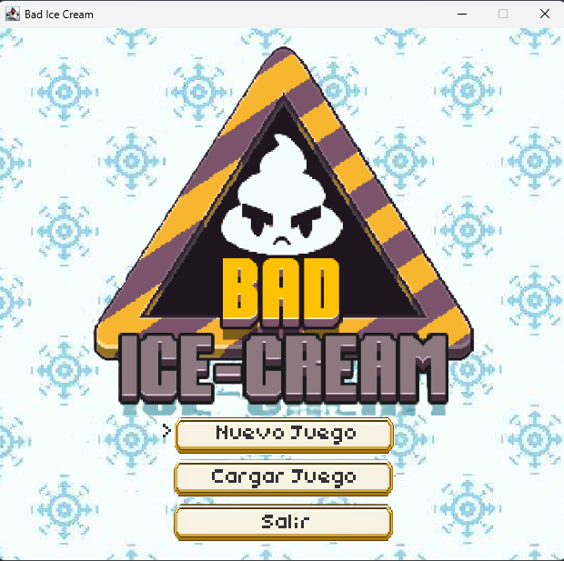
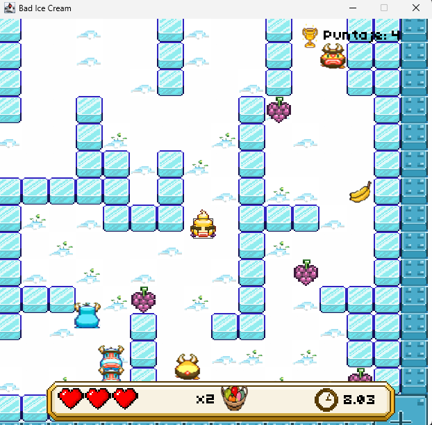

# 🍦 Bad Ice Cream 🍦
¡Bienvenido a Bad Ice Cream, un emocionante juego arcade para PC inspirado en el clásico de Nitrome! Prepárate para devorar todas las frutas de cada nivel mientras esquivas a molestos enemigos. ¿Tu arma? ¡Un aliento helado para crear y destruir barreras de hielo!

## 📸 Capturas de Pantalla

### Menú del juego

### Nivel 1

## ✨ Características Principales
- Jugabilidad Arcade Clásica: Disfruta de niveles que aumentan progresivamente en dificultad (En progreso).

- Guarda tu Progreso: Sistema completo para guardar y cargar tus partidas cuando quieras.

- Personalización: Ajusta el volumen y remapea los controles a tu gusto.

- Gráficos Encantadores: Sprites animados y arte personalizado que le dan vida al juego.

## 🚀 Instalación y Ejecución
Para empezar a jugar, solo sigue estos sencillos pasos:

- Clona el Repositorio:

  git clone https://github.com/tu-usuario/BadIceCream.git

- Abre el Proyecto: Cárgalo en tu IDE de Java favorito (recomendamos IntelliJ IDEA o Eclipse).

> [!NOTE]
> Requisitos: Asegúrate de tener instalado el JDK 8 o una versión superior.

- ¡A Jugar! Ejecuta la clase principal ubicada en src/main/BadIceCream.java.

## 📂 Estructura del Proyecto
El código está organizado en los siguientes paquetes para una fácil navegación:

- src/main/BadIceCream.java: El punto de entrada que inicia el juego.

- src/Negocio/: Contiene toda la lógica del juego: entidades (jugador, enemigos), niveles y mecánicas principales.

- src/datos/: Gestiona el guardado/carga de partidas y los archivos de configuración.

- src/presentación/: Se encarga de la interfaz gráfica (Swing) y la gestión del audio.

- src/datos/fuentes/: Almacena todos los recursos como sprites, mapas de niveles y fuentes.

## 📝 Notas Técnicas
Compatibilidad de SO: Las rutas de los archivos están configuradas para Windows. Si utilizas macOS o Linux, por favor, ajusta las rutas (/ en lugar de \) en las clases lectoras (GuardarCargar.java, Configuracion.java, etc.).

Crear Nuevos Niveles: Para expandir el juego, simplemente crea una nueva clase que herede de Nivel y define sus archivos de mapa, frutas y enemigos.

## 🏆 Créditos
Desarrollado con ❤️ por Matein0411 y colaboradores.

Si tienes alguna duda, sugerencia o encuentras un error, ¡no dudes en abrir un issue!
